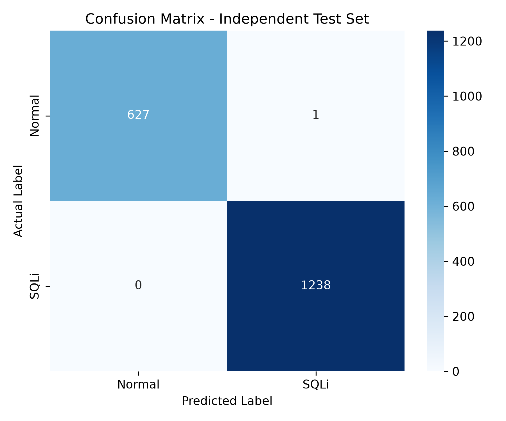

# AI-Driven Web Threat Detection & Real-Time SOC Monitoring System

> **Hệ thống Giám sát An ninh SOC & Phát hiện Tấn công SQL Injection dựa trên Machine Learning**
> 
> *Đề tài Bài tập lớn Học phần: An toàn Ứng dụng Web và Cơ sở Dữ liệu (INT14105) - Học viện Công nghệ Bưu chính Viễn thông (PTIT)*

---

## 📌 Tổng Quan Hệ Thống

Hệ thống được thiết kế theo kiến trúc **Giám sát An ninh Thụ động (Passive Security Monitoring)** dựa trên phân tích dòng log máy chủ web Apache thời gian thực. Khác với giải pháp Tường lửa Ứng dụng Web (WAF) Inline Proxy truyền thống dễ gây ra điểm nghẽn cổ chai và độ trễ mạng, hệ thống phân tích các HTTP Request (bao gồm cả phương thức GET Query String và POST JSON/Form Body) và ứng dụng mô hình **Random Forest Classifier** kết hợp kỹ thuật **Character N-grams TF-IDF** để phát hiện các hành vi khai thác lỗ hổng SQL Injection.



---

## ✨ Các Tính Năng Nổi Bật

1. **Pre-Execution AI Threat Inspector Engine:**
   * Bóc tách và giải mã HTTP Request (URL decoding đệ quy, JSON flattening).
   * Trích xuất không gian đặc trưng đa chiều (65 đặc trưng số học/cú pháp + 300 n-gram TF-IDF từ vựng).
   * Suy luận xác suất nguy cơ rủi ro $P(\text{SQLi})$ và bóc tách các chỉ báo đe dọa (Heuristic Indicators) giúp giải thích nguyên nhân cảnh báo.

2. **Chiến lược Phân chia Dữ liệu Chống Rò rỉ (Anti-Data Leakage Split):**
   * Sử dụng thuật toán `GroupShuffleSplit` nhóm theo mã băm cấu trúc `request_hash` (SHA-256) đảm bảo các biến thể cùng payload chỉ thuộc về duy nhất một tập (Train, Validation hoặc Test), triệt tiêu hoàn toàn hiện tượng học vẹt (overfitting/leakage).

3. **Web SOC Dashboard Thời Gian Thực:**
   * **Live Stream Event Table:** Ghi nhận và hiển thị liên tục luồng sự kiện truy cập HTTP.
   * **Alert Threshold Slider:** Cho phép sĩ quan SOC điều chỉnh linh hoạt ngưỡng cảnh báo động ($P_{\text{threshold}}$ từ 0.10 đến 0.95) đẩy trực tiếp về backend qua RESTful API `/api/waf/config`.
   * **Violation Inspector Modal:** Cửa sổ soi chi tiết tham số, payload, xác suất AI và danh sách quy luật vi phạm.
   * **Attack Type Breakdown Chart:** Biểu đồ phân loại tự động các họ tấn công (UNION-based, Error-based, Boolean Blind, Time-based Blind, JSON Injection).

4. **Kiểm Thử Khả Năng Chống Lẩn Tránh (Evasion Benchmark):**
   * Bộ kiểm thử tích hợp 12 kịch bản lẩn tránh nâng cao: Inline comment (`/**/`), MySQL Version Comment (`/*!50000*/`), Hex-encoding (`0x27...`), Watermarking, Nested JSON Body Injection...

---

## 🏗️ Kiến Trúc Hệ Thống

Hệ thống bao gồm 5 tầng thành phần chính:

```
[Máy chủ Web (Apache/DVWA trên Ubuntu Server)] 
       │ (Access Logs / Log Tailer over SSH/SFTP)
       ▼
[Tầng Tiền Xử Lý (Apache Parser & URL Decoder)]
       │
       ▼
[Tầng Trích Xuất Đặc Trưng (65 Numerical + 300 TF-IDF N-grams)]
       │
       ▼
[Tầng Suy Luận AI (Random Forest Classifier)]
       │
       ▼
[Tầng Hiển Thị SOC Dashboard (Web UI & RESTful APIs)]
```

---

## 📂 Cấu Trúc Thư Mục Dự Án

```text
├── DVWA/                       # Môi trường Web thử nghiệm Damn Vulnerable Web Application
├── baocao/                     # Báo cáo bài tập lớn (Word & tài liệu tham khảo)
├── dashboard/                  # Giao diện SOC Dashboard & Máy chủ Backend
│   ├── app.js                  # Lập trình xử lý giao diện Front-end (Fetch API, Live Stream)
│   ├── dashboard_backend.py    # Máy chủ Backend Python (Flask/HTTP Server, SSH Log Tailer)
│   ├── index.html              # Giao diện HTML Dashboard
│   └── style.css               # Bộ quy chuẩn thiết kế CSS (Dark Mode / Glassmorphism)
├── data/                       # Dữ liệu thực nghiệm
│   ├── apache_logs.csv         # Log đã phân tích cú pháp
│   ├── dataset.csv             # Tập dữ liệu chuẩn hóa
│   ├── features.csv            # Tập dữ liệu đã trích xuất đặc trưng
│   └── payloads_all.csv        # Tập tổng hợp mẫu payload
├── models/                     # Mô hình AI đã được huấn luyện
│   ├── feature_columns.pkl     # Danh sách các cột đặc trưng số
│   ├── sqli_rf_model.pkl       # Mô hình Random Forest đã huấn luyện (~1.8 MB)
│   └── tfidf_vectorizer.pkl    # Bộ vector hóa Character N-grams TF-IDF
├── reports/                    # Báo cáo đánh giá & Biểu đồ đồ thị
│   ├── classification_report.txt
│   ├── confusion_matrix.png
│   ├── dataset_report.txt
│   ├── feature_importance.png
│   ├── metrics.json
│   └── security_benchmark_report.json
├── src/                        # Mã nguồn cốt lõi
│   ├── collectors/             # Module sinh payload & gửi lưu lượng HTTP
│   │   ├── dvwa_generator/
│   │   └── traffic_generator.py
│   ├── data_processing/        # Module xử lý dữ liệu & trích xuất đặc trưng
│   │   ├── apache_parser.py
│   │   ├── dataset_builder.py
│   │   └── feature_extractor.py
│   ├── detector/               # Engine suy luận AI Threat Inspector
│   │   └── threat_detector.py
│   ├── training/               # Module huấn luyện & đánh giá mô hình
│   │   └── train_model.py
│   └── config.py               # File cấu hình đường dẫn trung tâm
├── tests/                      # Bộ kiểm thử tự động (Unit Test & Security Benchmark)
│   ├── test_security_benchmarks.py
│   └── test_threat_detector.py
├── predict.py                  # CLI dự đoán nhanh cho một HTTP Request
├── run_pipeline.py             # Pipeline tự động chạy toàn bộ quy trình từ log -> mô hình
├── requirements.txt            # Danh sách các thư viện Python phụ thuộc
└── pyproject.toml              # Cấu hình dự án Python
```

---

## ⚙️ Yêu Cầu Hệ Thống & Cài Đặt

### 1. Yêu cầu môi trường
* **Máy giám sát (SOC Machine):** Windows 10/11, macOS hoặc Linux chạy Python 3.10 trở lên.
* **Máy chủ mục tiêu (Target Web Server):** Ubuntu Server 22.04 LTS (hoặc 20.04/24.04 LTS).
* **Trình duyệt Web:** Chrome, Firefox, Edge hỗ trợ ES6 & Fetch API.

### 2. Cài đặt các thư viện phụ thuộc trên máy SOC
Chạy lệnh sau tại thư mục gốc của dự án:

```bash
pip install -r requirements.txt
```

*Các thư viện chính:* `scikit-learn`, `pandas`, `numpy`, `scipy`, `joblib`, `matplotlib`, `seaborn`.

---

## 🐧 Hướng Dẫn Cài Đặt DVWA Trên Ubuntu Server

Để dựng môi trường thử nghiệm ứng dụng web chứa lỗ hổng DVWA trên **Ubuntu Server 22.04 LTS**, thực hiện theo các bước chi tiết dưới đây:

### Bước 1: Cài đặt Web Server LAMP Stack (Apache, MySQL/MariaDB, PHP)
```bash
sudo apt update && sudo apt upgrade -y
sudo apt install apache2 mariadb-server php php-mysqli php-gd libapache2-mod-php git -y
```

### Bước 2: Tải mã nguồn DVWA vào Apache Document Root
```bash
cd /var/www/html
sudo git clone https://github.com/digininja/DVWA.git dvwa
sudo chown -R www-data:www-data /var/www/html/dvwa
sudo chmod -R 755 /var/www/html/dvwa
```

### Bước 3: Tạo Cơ Sở Dữ Liệu MySQL/MariaDB Cho DVWA
```bash
sudo mysql -u root -e "CREATE DATABASE dvwa;"
sudo mysql -u root -e "CREATE USER 'dvwa_user'@'localhost' IDENTIFIED BY 'password';"
sudo mysql -u root -e "GRANT ALL PRIVILEGES ON dvwa.* TO 'dvwa_user'@'localhost';"
sudo mysql -u root -e "FLUSH PRIVILEGES;"
```

### Bước 4: Cấu Hình File `config.inc.php` Của DVWA
```bash
cd /var/www/html/dvwa/config
sudo cp config.inc.php.dist config.inc.php
sudo nano config.inc.php
```
Cập nhật thông tin kết nối CSDL và ReCAPTCHA key:
```php
$_DVWA[ 'db_database' ] = 'dvwa';
$_DVWA[ 'db_user' ]     = 'dvwa_user';
$_DVWA[ 'db_password' ] = 'password';
$_DVWA[ 'db_port' ]     = '3306';

$_DVWA[ 'recaptcha_public_key' ]  = '6LdJ9SATAAAAAH2_615wWhVyTjwZz1xFZP7FJBNq';
$_DVWA[ 'recaptcha_private_key' ] = '6LdJ9SATAAAAAGko_1x2kP2D20v8w5vX1X0x8uXv';
```

### Bước 5: Cấu Hình PHP & Ghi Log Apache 
Sửa file cấu hình PHP `/etc/php/8.1/apache2/php.ini`:
```bash
sudo nano /etc/php/8.1/apache2/php.ini
```
* Bật hai tham số:
  ```ini
  allow_url_include = On
  allow_url_fopen = On
  ```

Đảm bảo Apache ghi nhận định dạng **Combined Log Format** tại `/var/log/apache2/access.log`:
```bash
sudo systemctl restart apache2 mariadb
```

### Bước 6: Khởi Tạo Database Trên Web Interface
1. Truy cập trình duyệt: `http://<IP_Ubuntu_Server>/dvwa/setup.php`
2. Nhấn nút **Create / Reset Database** ở cuối trang.
3. Đăng nhập hệ thống với tài khoản mặc định:
   * **Username:** `admin`
   * **Password:** `password`
4. Vào mục **DVWA Security** trên thanh menu trái, chuyển mức bảo mật sang **Low** và nhấn **Submit** để khởi tạo môi trường thực nghiệm các kỹ thuật tấn công SQL Injection.

---

## 🚀 Hướng Dẫn Sử Dụng Hệ Thống AI Security

### 1. Khởi chạy SOC Real-Time Monitoring Dashboard
Để khởi động máy chủ giám sát SOC và màn hình điều khiển:

```bash
python dashboard/dashboard_backend.py
```

* Sau khi chạy thành công, truy cập giao diện SOC Dashboard tại địa chỉ: **`http://127.0.0.1:5000`**
* Giao diện cung cấp bảng Live Stream sự kiện, tùy chỉnh thanh trượt **Alert Threshold**, xem chi tiết các chỉ báo vi phạm và biểu đồ tròn phân loại tấn công.

### 2. Kiểm thử dự đoán nhanh 1 HTTP Request (CLI)
Sử dụng script `predict.py` để kiểm tra khả năng phân loại của AI đối với một chuỗi HTTP Request bất kỳ:

```bash
# Kiểm thử request tấn công SQL Injection
python predict.py "GET /vulnerabilities/sqli/?id=1' UNION SELECT null, user FROM users-- HTTP/1.1"

# Kiểm thử request hợp lệ
python predict.py "GET /profile.php?user=john&lang=vi HTTP/1.1"
```

### 3. Thực thi toàn bộ Pipeline huấn luyện tự động
Nếu muốn tự động chạy lại toàn bộ quy trình (Parse log $\rightarrow$ Build Dataset $\rightarrow$ Extract Features $\rightarrow$ Train RF Model $\rightarrow$ Generate Reports):

```bash
python run_pipeline.py
```

### 4. Chạy bộ Kiểm thử Bảo mật & Chống Lẩn Tránh (Security Benchmark)
Để kiểm tra khả năng chống bypass của mô hình trên 12 kịch bản lẩn tránh phức tạp:

```bash
python tests/test_security_benchmarks.py
```

---

## 📊 Kết Quả Đánh Giá Hiệu Năng Mô Hình

Mô hình **Random Forest Classifier** được đánh giá trên tập kiểm thử độc lập (Test Set gồm 1.866 mẫu) với các chỉ số đo đạc:

| Mô hình phân loại | Accuracy | Precision | Recall (Critical) | F1-Score | ROC-AUC |
| :--- | :---: | :---: | :---: | :---: | :---: |
| **Multinomial Naive Bayes** | 78.03% | 72.41% | 82.50% | 77.12% | - |
| **Logistic Regression** | 99.68% | 99.45% | 99.89% | 99.67% | - |
| **Random Forest (Đề xuất)** | **99.95%** | **99.92%** | **100.00%** | **99.96%** | **1.0000** |

---

## 👥 Tác Giả & Thông Tin Nhóm

* **Nhóm sinh viên thực hiện:** Nhóm 09 - Lớp INT14105-01
  * Đặng Trần Hải Đăng (B23DCAT036)
  * Phan Đức (B23DCAT056)
  * Nguyễn Anh Minh (B23DCAT196)
  * Hoàng Tiến Toàn (B23DCAT296)
* **Giảng viên hướng dẫn:** ThS. Ninh Thị Thu Trang
* **Đơn vị:** Khoa An toàn Thông tin - Học viện Công nghệ Bưu chính Viễn thông.
