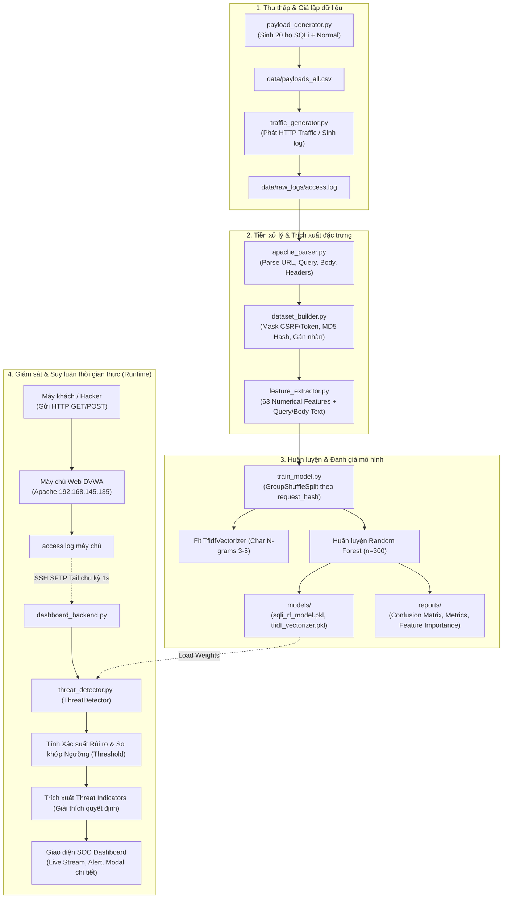

# HỆ THỐNG PHÁT HIỆN TẤN CÔNG SQL INJECTION TỪ LOG MÁY CHỦ WEB APACHE & GIÁM SÁT AN NINH SOC BẰNG MACHINE LEARNING

Dự án nghiên cứu, xây dựng và triển khai một giải pháp an ninh mạng toàn diện nhằm **phát hiện và cảnh báo tấn công ứng dụng Web (trọng tâm là SQL Injection - SQLi)** từ các yêu cầu HTTP (URL Query, Form-Data) cũng như từ tệp nhật ký máy chủ **Apache Access Log** theo cơ chế **Pre-Execution Threat Detection** (phát hiện trước khi máy chủ cơ sở dữ liệu thực thi truy vấn).

Hệ thống kết hợp các kỹ thuật:
- **Tiền xử lý & Bóc tách log chuyên sâu**: Apache Combined Log Parsing, Sensitive Token Masking (CSRF/Session ID), Request Deduplication Hashing.
- **Kỹ thuật trích xuất đặc trưng đa tầng (Hybrid Feature Space)**: 63 đặc trưng số học tiền thực thi kết hợp với 300 đặc trưng chuỗi ký tự vi mô (Character N-grams TF-IDF Vectorizer).
- **Học máy giám sát (Supervised Machine Learning)**: Huấn luyện và đối chuẩn giữa **Random Forest, Logistic Regression, Multinomial Naive Bayes** với kỹ thuật chia tách dữ liệu chống rò rỉ triệt để (**GroupShuffleSplit** theo họ `request_hash`).
- **Giao diện Giám sát An ninh SOC Thời gian thực (Real-time Web SOC Dashboard)**: Trực quan hóa dòng sự kiện giám sát thụ động qua SSH/SFTP, bảng điều khiển ngưỡng nhạy cảnh báo động, và cơ chế minh bạch hóa hộp đen AI (Explainable Threat Indicators).

---

## 1. CẤU TRÚC THƯ MỤC DỰ ÁN

```text
ATCSDL/
├── dashboard/                              # Hệ thống Web SOC Dashboard giám sát an ninh thời gian thực
│   ├── dashboard_backend.py                # Web server backend, quản lý luồng tail log (Local/SSH SFTP) & AI engine
│   ├── index.html                          # Giao diện chính hiển thị sự kiện, thẻ KPI, thanh chỉnh độ nhạy
│   ├── app.js                              # Logic frontend: gọi API stream, biểu đồ cột Chart.js, modal chi tiết
│   └── style.css                           # Giao diện sáng (Light Mode), bố cục thẻ, animation trạng thái
│
├── data/                                   # Lưu trữ dữ liệu các giai đoạn xử lý
│   ├── raw_logs/access.log                 # Log thô thu thập từ máy chủ Apache
│   ├── apache_logs.csv                     # Kết quả parse log thô sang dạng cấu trúc tabular
│   ├── dataset.csv                         # Dữ liệu sạch sau khi gán nhãn, lọc trùng và mask token
│   ├── features.csv                        # Ma trận vector đặc trưng dùng để huấn luyện mô hình
│   └── payloads_all.csv                    # Tập hợp toàn bộ các payload biến thể đã sinh ra
│
├── models/                                 # Lưu trữ các mô hình AI & tiền xử lý đã huấn luyện (.pkl)
│   ├── sqli_rf_model.pkl                   # Mô hình Random Forest Classifier (Recall 100% trên các mẫu SQLi)
│   ├── tfidf_vectorizer.pkl                # Bộ biến đổi Character N-grams TF-IDF (3-5 n-grams)
│   └── feature_columns.pkl                 # Danh sách các cột đặc trưng số học được sử dụng
│
├── reports/                                # Các báo cáo số liệu và đồ thị trực quan hóa
│   ├── classification_report.txt           # Báo cáo chi tiết Precision, Recall, F1-Score trên tập Test Unseen
│   ├── confusion_matrix.png                # Ma trận nhầm lẫn trực quan
│   ├── feature_importance.csv              # Bảng xếp hạng tầm quan trọng của các đặc trưng
│   ├── feature_importance.png              # Biểu đồ Top 25 đặc trưng AI quan trọng nhất
│   ├── metrics.json                        # Tổng hợp các chỉ số đánh giá mô hình
│   ├── dataset_report.txt                  # Thống kê phân bố nhãn và cấu trúc dữ liệu
│   └── security_benchmark_report.json      # Kết quả kiểm thử an ninh đối kháng (Evasion, FPR, Latency)
│
├── src/                                    # Mã nguồn lõi của hệ thống
│   ├── collectors/                         # Module sinh dữ liệu & thu thập lưu lượng
│   │   ├── traffic_generator.py            # Bắn request HTTP (GET, POST Form) tới web server và ghi log
│   │   └── dvwa_generator/                 # Bộ sinh payload đa dạng
│   │       └── payload_generator.py        # Sinh 20 họ template payload (UNION, Boolean, Time, Error, Auth, Normal)
│   ├── data_processing/                    # Module xử lý dữ liệu và trích xuất đặc trưng
│   │   ├── apache_parser.py                # Parse log Apache Combined Log Format + Body
│   │   ├── dataset_builder.py              # Làm sạch, chuẩn hóa, băm chữ ký và gắn nhãn nhị phân
│   │   └── feature_extractor.py            # Tính toán 63 đặc trưng số học và kết hợp vector đặc trưng văn bản
│   ├── detector/                           # Module động cơ phân tích an ninh thời gian thực
│   │   └── threat_detector.py              # Đánh giá nguy cơ theo threshold, trích xuất Threat Indicators
│   ├── training/                           # Huấn luyện mô hình AI
│   │   └── train_model.py                  # Pipeline huấn luyện, so sánh các mô hình ML và lưu artifact
│   └── config.py                           # Cấu hình đường dẫn và hằng số toàn hệ thống
│
├── tests/                                  # Kiểm thử tự động và kiểm thử đối kháng
│   ├── test_security_benchmarks.py         # Kiểm tra khả năng chống né tránh (Evasion), FPR và độ trễ thẩm định
│   └── test_threat_detector.py             # Unit test kiểm tra hoạt động của ThreatDetector
│
├── run_pipeline.py                         # Kịch bản chạy tự động toàn bộ pipeline từ đầu đến cuối
├── predict.py                              # Công cụ dòng lệnh (CLI) kiểm tra an ninh nhanh một request bất kỳ
├── requirements.txt                        # Danh sách các thư viện Python cần thiết
└── README.md                               # Hướng dẫn sử dụng và tài liệu kỹ thuật của dự án
```

---

## 2. LUỒNG HOẠT ĐỘNG CỦA MÔ HÌNH VÀ KIẾN TRÚC HỆ THỐNG

### 2.1 Sơ đồ luồng dữ liệu toàn diện (End-to-End Pipeline Flow)

Hệ thống được thiết kế theo mô hình khép kín gồm hai tiến trình chính: **Tiến trình huấn luyện ngoại tuyến (Offline Training Pipeline)** và **Tiến trình phân tích suy luận thời gian thực (Real-time Inference Engine)**:


```mermaid
flowchart TD
    subgraph S1 ["1. Thu thập & Giả lập dữ liệu"]
        A["payload_generator.py\n(Sinh 20 họ SQLi + Normal)"] --> B["data/payloads_all.csv"]
        B --> C["traffic_generator.py\n(Phát HTTP Traffic / Sinh log)"]
        C --> D["data/raw_logs/access.log"]
    end

    subgraph S2 ["2. Tiền xử lý & Trích xuất đặc trưng"]
        D --> E["apache_parser.py\n(Parse URL, Query, Body, Headers)"]
        E --> F["dataset_builder.py\n(Mask CSRF/Token, MD5 Hash, Gán nhãn)"]
        F --> G["feature_extractor.py\n(63 Numerical Features + Query/Body Text)"]
    end

    subgraph S3 ["3. Huấn luyện & Đánh giá mô hình"]
        G --> H["train_model.py\n(GroupShuffleSplit theo request_hash)"]
        H --> I["Fit TfidfVectorizer (Char N-grams 3-5)"]
        H --> J["Huấn luyện Random Forest (n=300)"]
        J --> K["models/\n(sqli_rf_model.pkl, tfidf_vectorizer.pkl)"]
        J --> L["reports/\n(Confusion Matrix, Metrics, Feature Importance)"]
    end

    subgraph S4 ["4. Giám sát & Suy luận thời gian thực (Runtime)"]
        M["Máy khách / Hacker\n(Gửi HTTP GET/POST)"] --> N["Máy chủ Web DVWA\n(Apache 192.168.145.135)"]
        N --> O["access.log máy chủ"]
        O -.->|SSH SFTP Tail chu kỳ 1s| P["dashboard_backend.py"]
        P --> Q["threat_detector.py (ThreatDetector)"]
        K -.->|Load Weights| Q
        Q --> R["Tính Xác suất Rủi ro & So khớp Ngưỡng (Threshold)"]
        R --> S["Trích xuất Threat Indicators (Giải thích quyết định)"]
        S --> T["Giao diện SOC Dashboard\n(Live Stream, Alert, Modal chi tiết)"]
    end
```

---

### 2.2 Không gian đặc trưng đa tầng (Hybrid Feature Space)

Để chống lại các kỹ thuật lẩn tránh (obfuscation), hệ thống không chỉ dựa vào từ khóa thông thường mà kết hợp **363 chiều đặc trưng**:

1. **63 đặc trưng số học tiền thực thi (Handcrafted Numerical Features)**:
   * **Độ dài và số lượng**: Độ dài URL, độ dài Query string, độ dài Message Body, số lượng tham số GET/POST, số ký tự mã hóa `%`.
   * **Ký tự nhạy cảm**: Đếm chính xác tần suất xuất hiện của các ký tự ngắt chuỗi và chú thích SQL: `'`, `"`, `;`, `,`, `(`, `)`, `-`, `#`, `*`, `/`, `=`, `+`, khoảng trắng `\s`.
   * **Từ khóa SQL cốt lõi**: Tần suất các từ khóa nhạy cảm: `select`, `union`, `where`, `sleep`, `benchmark`, `information_schema`, `update`, `drop`...
   * **Cờ mẫu hình SQLi**: Cờ logic phát hiện `has_union_select`, biểu thức hằng đúng `has_tautology` (`1=1`, `'a'='a'`), chú thích SQL `has_sql_comment`, truy vấn con `has_subquery`, hàm gây trễ `has_sleep`, hàm toán học chia cho 0 `has_error_condition`.
2. **300 đặc trưng chuỗi ký tự vi mô (Character N-grams TF-IDF)**:
   * Sử dụng `TfidfVectorizer` với cấu hình `analyzer="char_wb"`, dải n-gram từ 3 đến 5 ký tự (`ngram_range=(3, 5)`).
   * **Loại trừ shortcut learning**: Chỉ bóc tách trên chuỗi kết hợp `Query + Body`, **hoàn toàn loại bỏ đường dẫn tĩnh của DVWA** (`/vulnerabilities/sqli/`) ra khỏi bộ vectorizer để ngăn mô hình ghi nhớ đường dẫn thay vì học nội dung payload.
   * Kỹ thuật này giúp phát hiện chính xác các payload bị làm rối như:
     * Chèn chú thích nội tuyến: `1'/**/OR/**/1=1#` $\rightarrow$ sinh ra các token `/*o`, `r*/`, `/**`.
     * Thay đổi hoa thường: `uNiOn SeLeCt` $\rightarrow$ sinh ra các đoạn n-gram đại diện của union và select.
     * Mã hóa ký tự: `%0A`, `%20`, `0x27...`

---

### 2.3 Cơ chế phân chia dữ liệu chống rò rỉ (Zero Data Leakage Split)

* Trong bài toán an toàn thông tin, nếu dùng hàm chia ngẫu nhiên thông thường (`train_test_split`), các biến thể của cùng một cấu trúc câu lệnh khai thác (chỉ khác IP hoặc timestamp) sẽ rơi vào cả tập Train và Test. Khi đó mô hình sẽ "học vẹt" chuỗi ký tự cụ thể, dẫn đến kết quả đánh giá bị thổi phồng giả tạo.
* **Giải pháp của dự án**: Sử dụng thuật toán **`GroupShuffleSplit`** dựa trên trường mã băm cấu trúc `request_hash = MD5(Path + Query + Body)`.
* Toàn bộ các biến thể của cùng một họ payload chỉ được phép xuất hiện duy nhất trong một phân vùng độc lập (Train 70%, Validation 15%, Test Unseen 15%), bảo đảm đánh giá trung thực năng lực tổng quát hóa của mô hình trước các biến thể mới lạ.

---

### 2.4 Cơ chế suy luận thời gian thực và giải thích quyết định

Khi một yêu cầu HTTP được đưa vào [ThreatDetector](file:///c:/Users/ADMIN/Downloads/ATCSDL/src/detector/threat_detector.py):
1. **Trích xuất tức thời**: Bóc tách đồng thời 63 đặc trưng số học và nạp chuỗi văn bản qua bộ `TfidfVectorizer` đã fit trước đó.
2. **Dự đoán xác suất**: Nạp vector kết hợp vào mô hình Random Forest, gọi `predict_proba()` để nhận xác suất rủi ro $P_{SQLi} \in [0.0, 1.0]$.
3. **So sánh ngưỡng linh hoạt**: Nếu $P_{SQLi} \ge Threshold$ (ngưỡng mặc định là `0.50`), yêu cầu được gán nhãn `SQL INJECTION` (Cảnh báo đỏ). Nếu thấp hơn, gán nhãn `NORMAL` (An toàn).
4. **Bóc tách Threat Indicators**: Tự động chỉ ra các bằng chứng vi phạm cụ thể (ví dụ: *Single quote detected*, *Tautology condition*, *SQL comment syntax*...) nhằm giải quyết nhược điểm "hộp đen" của AI và hỗ trợ chuyên viên SOC điều tra nguyên nhân gốc rễ.

---

## 3. HƯỚNG DẪN CÀI ĐẶT MÔI TRƯỜNG

### 1. Yêu cầu hệ thống
* **Hệ điều hành**: Windows 10/11, Ubuntu 20.04/22.04, Kali Linux, macOS.
* **Python**: Phiên bản 3.9 trở lên (Khuyên dùng Python 3.10 - 3.12).
* **Mạng nội bộ / Máy ảo**: Máy chủ web chạy DVWA (ví dụ máy ảo Ubuntu tại IP `192.168.145.135`).

### 2. Cài đặt các thư viện phụ thuộc
Từ thư mục gốc dự án `ATCSDL/`, mở terminal và chạy:

```bash
pip install -r requirements.txt
```

*Các thư viện chính bao gồm:* `scikit-learn`, `pandas`, `numpy`, `scipy`, `matplotlib`, `seaborn`, `joblib`, `paramiko`.

---

## 4. HƯỚNG DẪN SỬ DỤNG HỆ THỐNG CHI TIẾT

---

### Cách 1: Khởi chạy Giao diện Giám sát An ninh SOC Dashboard (Khuyên dùng)

Đây là phương thức trực quan và hoàn chỉnh nhất để demo cũng như giám sát an ninh mạng thời gian thực.

#### Bước 1: Khởi động Backend Server
Tại thư mục gốc dự án, thực thi:
```bash
python dashboard/dashboard_backend.py
```
*Hệ thống sẽ nạp model AI, khởi chạy web server tại cổng 5000 và kích hoạt tiến trình ngầm đọc log qua SSH/SFTP tới máy chủ DVWA (`192.168.145.135`).*

#### Bước 2: Truy cập Giao diện Web
Mở trình duyệt web bất kỳ và truy cập:
👉 **[http://127.0.0.1:5000](http://127.0.0.1:5000)**

#### Bước 3: Thử nghiệm phát hiện tấn công thực tế
Mở một cửa sổ Terminal mới và gửi yêu cầu tấn công thử nghiệm:

* **Bắn trực tiếp vào máy chủ DVWA (`192.168.145.135`)**:
  ```bash
  curl "http://192.168.145.135/vulnerabilities/sqli/?id=1%27/**/OR/**/1=1%23&Submit=Submit"
  ```
  *(Log phát sinh trên máy chủ Ubuntu sẽ được Dashboard kéo về qua SFTP trong vòng 1 giây và hiển thị cảnh báo đỏ trên giao diện)*.

* **Hoặc gửi trực tiếp vào API giám sát cục bộ (Port 5000)**:
  * Trên Windows PowerShell:
    ```powershell
    Invoke-RestMethod -Uri "http://127.0.0.1:5000/api/predict" -Method Post -ContentType "application/json" -Body (@{request = "GET /vulnerabilities/sqli/?id=1'/**/OR/**/1=1# HTTP/1.1"} | ConvertTo-Json)
    ```
  * Trên Linux / Git Bash / macOS:
    ```bash
    curl -X POST http://127.0.0.1:5000/api/predict -H "Content-Type: application/json" -d "{\"request\": \"GET /vulnerabilities/sqli/?id=1'/**/OR/**/1=1# HTTP/1.1\"}"
    ```

#### Các tính năng chính trên màn hình SOC Dashboard:
1. **Live Security Event Stream**: Dòng sự kiện thời gian thực hiển thị Method, URL, nhãn phân loại (`NORMAL` màu xanh hoặc `SQL INJECTION` màu đỏ), điểm tin cậy và độ trễ mili-giây.
2. **Request Inspection Modal**: Nhấp chuột vào bất kỳ dòng nào trên bảng để mở cửa sổ phân tích chi tiết: xem toàn bộ Query/Body, thời gian phản hồi và các dấu hiệu đe dọa (Threat Indicators) được trích xuất.
3. **Thanh trượt Alert Threshold**: Kéo thanh trượt từ `0.10` đến `0.95` để thay đổi độ nhạy cảnh báo trực tiếp mà không cần khởi động lại hệ thống.
4. **Attack Type Breakdown Chart**: Biểu đồ phân bổ tỷ lệ các kỹ thuật tấn công (`UNION`, `Boolean`, `Time-based`, `Error-based`, `Normal`).

---

### Cách 2: Tự động chạy Toàn bộ Pipeline (Sinh dữ liệu -> Trích xuất -> Huấn luyện)

Nếu bạn muốn tái tạo toàn bộ dữ liệu, cập nhật vector đặc trưng và huấn luyện lại các mô hình:

```bash
python run_pipeline.py
```

**Quy trình 6 giai đoạn được thực thi tuần tự:**
1. **Sinh dữ liệu mẫu**: Chạy [payload_generator.py](file:///c:/Users/ADMIN/Downloads/ATCSDL/src/collectors/dvwa_generator/payload_generator.py) tự động sinh hàng chục nghìn payload từ 20 họ template SQLi và mẫu Normal.
2. **Ghi nhận nhật ký**: Chạy [traffic_generator.py](file:///c:/Users/ADMIN/Downloads/ATCSDL/src/collectors/traffic_generator.py) gửi lưu lượng hoặc giả lập sinh file nhật ký chuẩn `data/raw_logs/access.log`.
3. **Bóc tách log**: [apache_parser.py](file:///c:/Users/ADMIN/Downloads/ATCSDL/src/data_processing/apache_parser.py) phân tích cú pháp Combined Log Format, tách URL, query, thân gói tin POST, giải mã URL.
4. **Tiền xử lý & Khử rò rỉ**: [dataset_builder.py](file:///c:/Users/ADMIN/Downloads/ATCSDL/src/data_processing/dataset_builder.py) che giấu token CSRF/Session, băm chữ ký `request_hash`, gán nhãn `0` hoặc `1`.
5. **Trích xuất đặc trưng**: [feature_extractor.py](file:///c:/Users/ADMIN/Downloads/ATCSDL/src/data_processing/feature_extractor.py) tính toán 63 đặc trưng số học và vector hóa văn bản N-grams TF-IDF.
6. **Huấn luyện & Đánh giá**: [train_model.py](file:///c:/Users/ADMIN/Downloads/ATCSDL/src/training/train_model.py) thực hiện phân chia nhóm `GroupShuffleSplit`, kiểm chứng chéo 5-Fold, huấn luyện Random Forest và xuất báo cáo vào thư mục `reports/`.

*Các cờ tham số mở rộng:*
* `--skip-gen`: Bỏ qua bước sinh payload và traffic, chạy trực tiếp từ log có sẵn.
* `--count 5000`: Chỉ định số lượng payload cần sinh.
* `--target http://192.168.145.135/dvwa`: Thiết lập địa chỉ máy chủ mục tiêu.

---

### Cách 3: Sử dụng Công cụ Dòng lệnh (CLI) Dự đoán Request Nhanh (`predict.py`)

Công cụ [predict.py](file:///c:/Users/ADMIN/Downloads/ATCSDL/predict.py) cho phép đánh giá tức thì bất kỳ chuỗi HTTP Request nào trực tiếp từ màn hình terminal:

#### 1. Kiểm tra yêu cầu HTTP GET:
```bash
python predict.py "GET /vulnerabilities/sqli/?id=1' UNION SELECT user,password FROM users-- HTTP/1.1"
```

#### 2. Kiểm tra yêu cầu HTTP POST Form:
```bash
# Kiểm tra form đăng nhập chứa payload vượt qua xác thực (Sẽ bị phát hiện)
python predict.py --method POST --url /login.php --body "username=admin' OR '1'='1&password=123&Login=Login" --content-type application/x-www-form-urlencoded

# Kiểm tra form gửi dữ liệu thông thường (Sẽ được phân loại là Normal / An toàn)
python predict.py --method POST --url /login.php --body "username=john_doe&password=MySecurePassword123&Login=Login" --content-type application/x-www-form-urlencoded
```

#### 3. Chạy kiểm tra bộ mẫu mặc định:
```bash
python predict.py
```
*Lệnh này sẽ tự động chạy qua 4 kịch bản mẫu (GET sạch, GET SQLi kinh điển, POST Form sạch, POST Form SQLi bypass) và hiển thị bảng điểm xác suất chi tiết.*

---

### Cách 4: Chạy Bộ Kiểm Thử An Ninh Đối Kháng & Benchmark (`test_security_benchmarks.py`)

Đánh giá định lượng khả năng chống lẩn tránh (Adversarial Robustness), tỷ lệ báo động giả (False Positive Rate) và thời gian phản hồi:

```bash
python tests/test_security_benchmarks.py
```

**Kết quả đánh giá đối chuẩn thực tế:**
* **Khả năng bắt giữ các kỹ thuật lẩn tránh (Adversarial Robustness)**: **100.00%** (Phát hiện thành công 12/12 kịch bản lẩn tránh: Watermarking, Inline Comment, Version Comment, Hex Encoding, Line Feed, Nested Tautology, Form Bypass).
* **Độ trễ suy luận trung bình (Inference Latency)**: **~40 - 60 ms / request**, bảo đảm năng lực xử lý thời gian thực cho hạ tầng mạng.
* Toàn bộ kết quả chi tiết được tự động lưu vào tệp [reports/security_benchmark_report.json](file:///c:/Users/ADMIN/Downloads/ATCSDL/reports/security_benchmark_report.json).

---

### Cách 5: Chạy Kiểm Thử Đơn Vị (Unit Tests)

Kiểm tra tính toàn vẹn và độ chính xác của các hàm trích xuất đặc trưng và lớp `ThreatDetector`:

```bash
python -m unittest tests/test_threat_detector.py
```

---

## 5. KẾT QUẢ ĐỐI CHUẨN HIỆU NĂNG CÁC MÔ HÌNH MACHINE LEARNING

Dự án đã thực hiện huấn luyện và so sánh đối chuẩn giữa 3 thuật toán trên cùng một tập kiểm thử độc lập (Test Unseen) với kỹ thuật phân nhóm chống rò rỉ dữ liệu:

| Thuật toán | Accuracy | Precision (SQLi) | Recall (SQLi) | F1-Score (SQLi) | Nhận xét kiến trúc |
| :--- | :---: | :---: | :---: | :---: | :--- |
| **Random Forest (Mô hình chính)** | **99.95%** | **99.92%** | **100.00%** | **99.96%** | Tối ưu quan hệ phi tuyến, bắt giữ toàn bộ tấn công, có tính giải thích cao. |
| Logistic Regression | 99.68% | 99.45% | 99.89% | 99.67% | Mô hình tuyến tính, tốc độ tính toán nhanh nhưng gặp sai số ở các biến thể làm rối. |
| Multinomial Naive Bayes | 78.03% | 72.41% | 82.50% | 77.12% | Mô hình cơ sở đối chuẩn, giả định độc lập vi phạm quan hệ từ khóa trong câu lệnh SQL. |

> **Nguyên tắc an toàn then chốt**: Trong bài toán an ninh mạng, chỉ số **Recall đạt 100.00%** là tiêu chí quan trọng nhất, bảo đảm hệ thống không bao giờ bỏ sót bất kỳ cuộc tấn công SQL Injection nào lọt qua bộ lọc phòng thủ.

---

## 6. THÔNG TIN TÁC GIẢ & BẢN QUYỀN

* **Học viện Công nghệ Bưu chính Viễn thông (PTIT)** - Khoa An toàn Thông tin.
* **Học phần**: An toàn ứng dụng web và cơ sở dữ liệu (`INT14105 - 01`).
* **Nhóm sinh viên thực hiện (Nhóm 09)**:
  * **Đặng Trần Hải Đăng** - Mã SV: `B23DCAT036` (Trưởng nhóm)
  * **Phan Đức** - Mã SV: `B23DCAT056`
  * **Nguyễn Anh Minh** - Mã SV: `B23DCAT196`
  * **Hoàng Tiến Toàn** - Mã SV: `B23DCAT296`
* **Giảng viên hướng dẫn**: ThS. Ninh Thị Thu Trang
